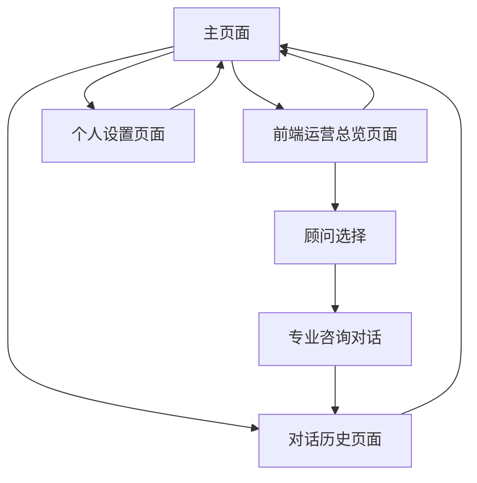

# Coze Web SDK 智能对话应用产品需求文档

## 1. Product Overview
基于Coze Web SDK构建的个人专属智能对话应用，为个人用户提供便捷的AI顾问服务。通过集成Coze平台的AI能力，实现智能问答、专业咨询和任务处理功能。 <mcreference link="https://blog.axiaoxin.com/post/coze-intro/" index="3">3</mcreference>
- 解决个人用户在日常工作和生活中需要专业顾问和AI助手的需求，提供24小时个人专属服务能力。 <mcreference link="https://blog.csdn.net/Explinks/article/details/140321936" index="1">1</mcreference>
- 目标是为个人用户提供一站式AI顾问服务平台，涵盖财务、营销、开发、广告、销售等多个专业领域。

## 2. Core Features

### 2.1 用户模式
**个人专属模式**
- 无需注册登录，直接使用所有功能
- 本地数据存储，保护个人隐私
- 完整访问所有AI顾问服务
- 个人化配置和偏好设置
- 本地对话历史管理

### 2.2 功能模块
个人专属Coze Web SDK智能对话应用包含以下主要页面：
1. **主页面**：智能对话界面、功能导航、个人状态显示
2. **前端运营总览页面**：个人专属AI顾问服务，专业咨询功能
3. **对话历史页面**：本地历史记录查看、对话管理、搜索功能
4. **个人设置页面**：个人偏好、AI助手配置、界面定制

### 2.3 个人专属顾问服务平台
个人专属顾问服务平台是本应用的核心功能模块，为个人用户提供全方位的专业AI顾问服务。该模块采用电脑网页UI设计，所有顾问服务均为个人专属，无需与他人共享，包含以下顾问类型：

#### 2.3.1 个人专属顾问服务分类
**通用专业顾问：**
- 公司战略顾问：为个人创业或职业规划提供战略建议、商业模式分析等咨询服务
- 人事顾问：提供个人职业发展、面试技巧、职场规划等专业建议
- 股票顾问：提供个人投资分析、理财规划、市场趋势预测等金融咨询

**个人专属多领域顾问服务（每类包含3个专业版本）：**
1. **个人财务顾问**
   - 颜泡泡财务顾问：专注个人美妆消费理财和相关投资建议
   - 宠小妹财务顾问：专注个人宠物消费预算和宠物相关投资分析
   - 玥星球财务顾问：专注个人科技产品投资和新兴科技理财规划

2. **个人营销顾问**
   - 颜泡泡营销顾问：个人美妆品牌建设和社交媒体营销指导
   - 宠小妹营销顾问：个人宠物相关内容创作和营销策略顾问
   - 玥星球营销顾问：个人科技内容创作和数字营销创新顾问

3. **个人开发顾问**
   - 颜泡泡开发顾问：个人美妆相关项目开发和技术学习指导
   - 宠小妹开发顾问：个人宠物相关应用开发和技术咨询
   - 玥星球开发顾问：个人前沿科技项目开发和技术成长顾问

4. **个人广告顾问**
   - 颜泡泡广告顾问：个人美妆内容广告创意和推广策略专家
   - 宠小妹广告顾问：个人宠物内容广告策划和投放顾问
   - 玥星球广告顾问：个人科技内容广告优化和效果分析顾问

5. **个人销售顾问**
   - 颜泡泡销售顾问：个人美妆产品销售技巧和客户沟通专家
   - 宠小妹销售顾问：个人宠物服务销售策略和渠道建设顾问
   - 玥星球销售顾问：个人科技产品销售模式和商业谈判顾问

6. **个人服务顾问**
   - 颜泡泡服务顾问：个人美妆咨询服务和客户关系管理专家
   - 宠小妹服务顾问：个人宠物护理服务和客户关怀指导顾问
   - 玥星球服务顾问：个人科技服务体验优化和用户满意度提升顾问

### 2.4 Page Details
| Page Name | Module Name | Feature description |
|-----------|-------------|---------------------|
| 主页面 | 智能对话界面 | 实时对话交互，支持文本输入、语音识别、文件上传功能 <mcreference link="https://blog.csdn.net/weixin_43891901/article/details/146458911" index="4">4</mcreference> |
| 主页面 | 功能导航 | 显示可用功能模块，快速访问常用工具和服务 |
| 主页面 | 个人状态显示 | 显示当前会话信息、使用统计、个人偏好状态 |
| 个人专属顾问平台 | 顾问服务导航 | 展示所有个人专属AI顾问服务，分类显示通用顾问和多领域专业顾问 |
| 个人专属顾问平台 | 顾问选择界面 | 个人可选择具体的顾问类型，查看顾问专业领域和个人化服务介绍 |
| 个人专属顾问平台 | 专业咨询对话 | 与选定顾问进行一对一专业对话，获得个人定制化建议和解决方案 |
| 对话历史页面 | 本地历史记录 | 按时间排序显示所有个人对话记录，本地存储，支持分页浏览 |
| 对话历史页面 | 个人对话管理 | 删除、收藏、标签分类个人对话记录功能 |
| 对话历史页面 | 智能搜索功能 | 关键词搜索个人历史对话内容，支持顾问类型筛选 |
| 个人设置页面 | 个人偏好 | 界面主题、语言设置、快捷键配置、通知偏好 |
| 个人设置页面 | AI助手配置 | 选择AI模型、调整对话风格、设置专业领域偏好 |
| 个人设置页面 | 数据管理 | 本地数据备份、导入导出、清理缓存 |
| 个人设置页面 | 系统配置 | API密钥管理、功能开关、隐私设置 |

## 3. Core Process
**个人用户使用流程：**
打开应用 → 选择进入前端运营总览 → 选择专业顾问类型 → 开始专业咨询对话 → 获得专业建议 → 本地保存咨询结果 → 结束会话

**顾问咨询流程：**
进入运营总览页面 → 浏览顾问分类 → 选择具体顾问（如颜泡泡财务顾问）→ 查看顾问专业介绍 → 开始专业对话 → 获得针对性建议 → 保存到本地历史

**个人设置流程：**
进入个人设置 → 配置AI助手参数 → 调整个人偏好 → 管理本地数据 → 备份重要对话

## 4. User Interface Design
### 4.1 Design Style
- 主色调：蓝色系（#1890FF）和白色（#FFFFFF），辅助色为灰色（#F5F5F5）
- 按钮样式：圆角按钮，悬浮阴影效果
- 字体：系统默认字体，标题16px，正文14px，辅助文字12px
- 布局风格：卡片式设计，顶部导航栏，响应式布局
- 图标风格：线性图标，简洁现代，支持深色模式切换

### 4.2 个人专属界面设计概览
| Page Name | Module Name | UI Elements |
|-----------|-------------|-------------|
| 主页面 | 智能对话界面 | 个人化聊天气泡样式，输入框带发送按钮，支持拖拽文件上传，语音按钮 |
| 主页面 | 功能导航 | 顶部横向导航栏，图标+文字组合，个人化主题悬浮效果 |
| 个人专属顾问平台 | 顾问服务网格 | 个人化卡片式布局，每个顾问显示为独立卡片，包含个性化图标、名称、专业描述 |
| 个人专属顾问平台 | 顾问分类标签 | 顶部分类导航，支持筛选通用顾问和多领域专业顾问服务 |
| 个人专属顾问平台 | 专业咨询界面 | 一对一专业化聊天界面，显示顾问头像、专业标签、个人定制建议标识 |
| 对话历史页面 | 本地历史记录 | 时间轴样式列表，每条记录显示时间、摘要、顾问类型、个人标签、操作按钮 |
| 个人设置页面 | 个人配置面板 | 分组表单设计，个性化开关按钮，下拉选择器，滑块控件 |
| 个人设置页面 | 个人数据面板 | 个人使用统计，图表展示，本地数据管理，顾问使用偏好分析 |

### 4.3 Responsiveness
采用移动端优先的响应式设计，支持桌面端、平板和手机端访问。针对触屏设备优化交互体验，支持手势操作和语音输入。 <mcreference link="https://blog.csdn.net/gitblog_00040/article/details/139735672" index="2">2</mcreference>