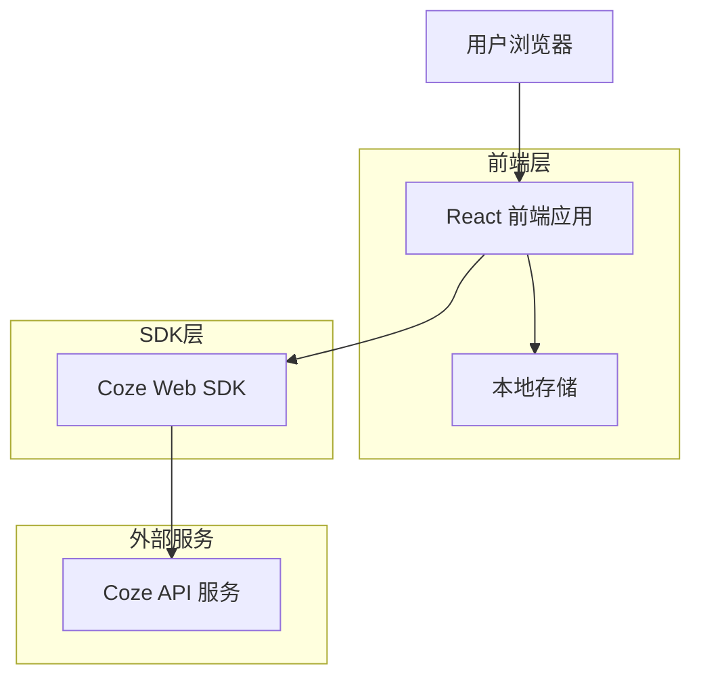
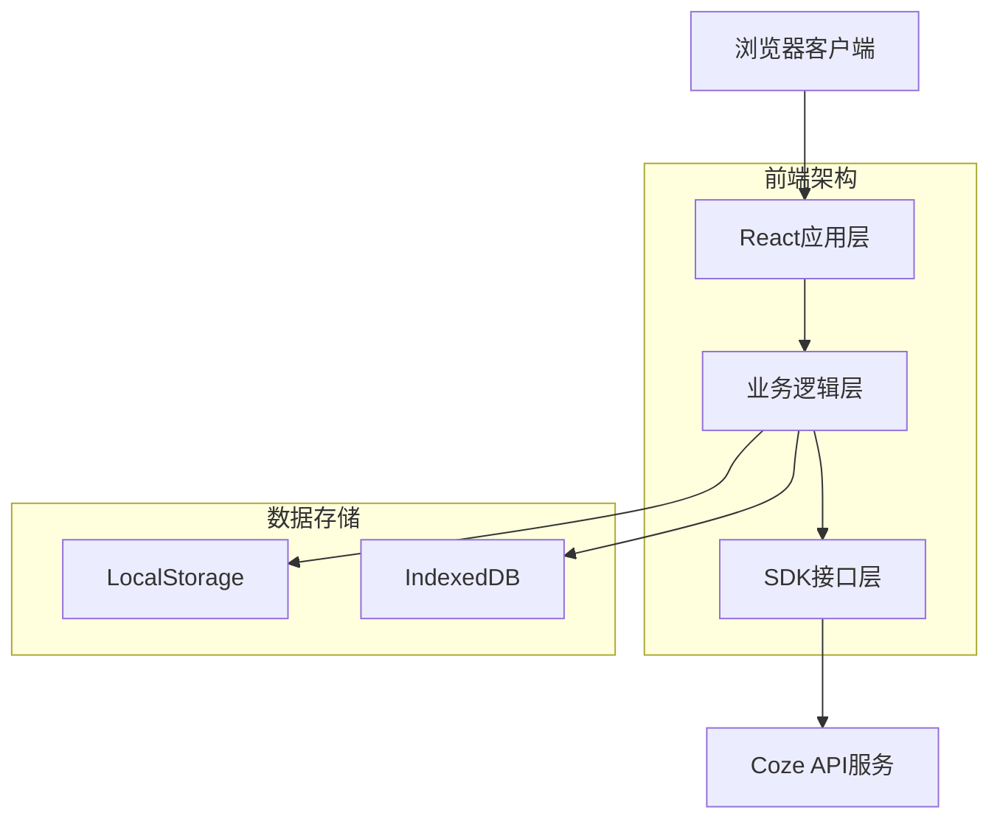
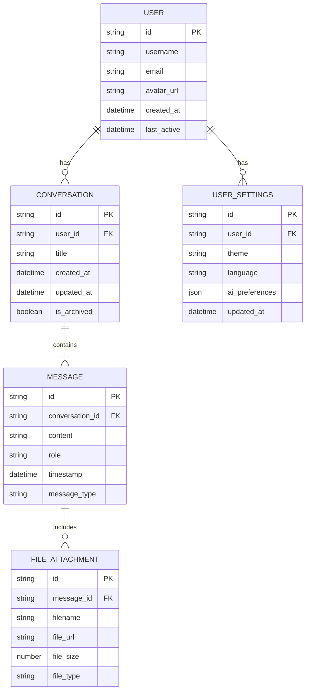

# Coze Web SDK 智能对话应用技术架构文档

## 1. Architecture design



## 2. Technology Description
- 前端：React@18 + TypeScript + Tailwind CSS@3 + Vite
- SDK：Coze Web SDK (官方JavaScript库)
- 状态管理：Zustand
- 本地存储：LocalStorage + IndexedDB
- 构建工具：Vite + ESBuild
- 环境配置：dotenv + 环境变量管理

## 2.1 安全配置管理

### 环境变量配置
项目使用环境变量管理敏感信息，确保token等机密数据不会被硬编码到源代码中。

**环境变量列表**
| 变量名 | 描述 | 示例值 |
|--------|------|--------|
| VITE_COZE_SAT_TOKEN | Coze SAT鉴权token | sat_xxx... |
| VITE_COZE_BOT_ID | Coze机器人ID | bot_xxx... |
| VITE_COZE_API_BASE_URL | Coze API基础URL | https://api.coze.cn |

**配置文件结构**
```
项目根目录/
├── .env.example          # 环境变量模板文件
├── .env.local            # 本地开发环境变量（不提交）
├── .env.production       # 生产环境变量（不提交）
└── .gitignore           # Git忽略文件配置
```

**.env.example 模板文件**
```bash
# Coze API 配置
VITE_COZE_SAT_TOKEN=your_sat_token_here
VITE_COZE_BOT_ID=your_bot_id_here
VITE_COZE_API_BASE_URL=https://api.coze.cn

# 应用配置
VITE_APP_TITLE=Coze智能对话应用
VITE_APP_VERSION=1.0.0
```

**.env.local 本地开发配置**
```bash
# 本地开发环境 - 请勿提交此文件
VITE_COZE_SAT_TOKEN=sat_P9aesxbg2IKXyDuS70T9ArcaaERxCV2adE7EEtOgbs0ju3BVZ3TDh57JKHjQ4ZBP
VITE_COZE_BOT_ID=your_actual_bot_id
VITE_COZE_API_BASE_URL=https://api.coze.cn
```

**.gitignore 配置**
```gitignore
# 环境变量文件
.env.local
.env.production
.env.*.local

# 依赖
node_modules/

# 构建输出
dist/
build/

# 日志
*.log
npm-debug.log*
yarn-debug.log*
yarn-error.log*

# 编辑器
.vscode/
.idea/
*.swp
*.swo

# 操作系统
.DS_Store
Thumbs.db
```

### 安全最佳实践

1. **Token管理原则**
   - 🚫 **绝不**将token硬编码到源代码中
   - ✅ 使用环境变量存储所有敏感信息
   - ✅ 提供.env.example模板文件供团队使用
   - ✅ 将所有.env.*文件添加到.gitignore中

2. **开发环境配置**
   ```bash
   # 1. 复制环境变量模板
   cp .env.example .env.local
   
   # 2. 编辑.env.local文件，填入真实的token值
   # 3. 启动开发服务器
   npm run dev
   ```

3. **生产环境部署**
   - 在部署平台（如Vercel、Netlify）的环境变量设置中配置token
   - 确保生产环境token与开发环境分离
   - 定期轮换token以提高安全性

4. **代码中的安全使用**
   ```javascript
   // ✅ 正确：使用环境变量
   const token = import.meta.env.VITE_COZE_SAT_TOKEN;
   
   // 🚫 错误：硬编码token
   const token = 'sat_P9aesxbg2IKXyDuS70T9ArcaaERxCV2adE7EEtOgbs0ju3BVZ3TDh57JKHjQ4ZBP';
   
   // ✅ 正确：添加环境变量检查
   if (!import.meta.env.VITE_COZE_SAT_TOKEN) {
     throw new Error('VITE_COZE_SAT_TOKEN environment variable is required');
   }
   ```

5. **团队协作规范**
   - 新成员加入时，提供环境变量配置指南
   - 定期检查代码，确保没有硬编码的敏感信息
   - 使用代码审查流程，防止敏感信息泄露

## 3. Route definitions
| Route | Purpose |
|-------|----------|
| / | 主页面，智能对话界面和核心功能 |
| /history | 对话历史页面，查看和管理历史记录 |
| /settings | 设置页面，个人配置和AI助手设置 |
| /admin | 管理后台，系统管理和数据统计 |
| /login | 登录页面，用户认证 |

## 4. API definitions
### 4.1 Core API

**Coze Web SDK 集成**
```javascript
// SDK 初始化 - 使用环境变量
CozeWebSDK.init({
  token: process.env.VITE_COZE_SAT_TOKEN,
  botId: process.env.VITE_COZE_BOT_ID,
  baseURL: process.env.VITE_COZE_API_BASE_URL || 'https://api.coze.cn'
})
```

**对话接口**
```
POST /v1/conversation/chat
```

Request:
| Param Name | Param Type | isRequired | Description |
|------------|------------|------------|-------------|
| message | string | true | 用户输入的消息内容 |
| conversation_id | string | false | 会话ID，用于维持对话上下文 |
| user_id | string | false | 用户标识符 |
| stream | boolean | false | 是否启用流式响应 |

Response:
| Param Name | Param Type | Description |
|------------|------------|-------------|
| message | string | AI回复的消息内容 |
| conversation_id | string | 会话ID |
| status | string | 响应状态 |

Example:
```json
{
  "message": "你好，我是AI助手，有什么可以帮助你的吗？",
  "conversation_id": "conv_123456",
  "status": "success"
}
```

**文件上传接口**
```
POST /v1/files/upload
```

Request:
| Param Name | Param Type | isRequired | Description |
|------------|------------|------------|-------------|
| file | File | true | 上传的文件对象 |
| purpose | string | true | 文件用途（如：chat, knowledge） |

Response:
| Param Name | Param Type | Description |
|------------|------------|-------------|
| file_id | string | 文件唯一标识符 |
| filename | string | 文件名称 |
| size | number | 文件大小 |
| url | string | 文件访问链接 |

## 5. Server architecture diagram
由于采用纯前端架构，直接通过Coze Web SDK与Coze服务通信，无需独立后端服务。



## 6. Data model

### 6.1 Data model definition


### 6.2 Data Definition Language
由于采用前端存储方案，使用LocalStorage和IndexedDB进行数据管理：

**LocalStorage 存储结构**
```javascript
// 用户设置
const userSettings = {
  theme: 'light', // light | dark
  language: 'zh-CN',
  aiPreferences: {
    model: 'gpt-4',
    temperature: 0.7,
    maxTokens: 2000
  }
};

// 当前会话状态
const currentSession = {
  conversationId: 'conv_123456',
  userId: 'user_789',
  lastActivity: '2024-01-15T10:30:00Z'
};
```

**IndexedDB 数据库结构**
```javascript
// 数据库：CozeApp，版本：1

// 对象存储：conversations
const conversationStore = {
  keyPath: 'id',
  indexes: [
    { name: 'userId', keyPath: 'userId' },
    { name: 'createdAt', keyPath: 'createdAt' },
    { name: 'updatedAt', keyPath: 'updatedAt' }
  ]
};

// 对象存储：messages
const messageStore = {
  keyPath: 'id',
  indexes: [
    { name: 'conversationId', keyPath: 'conversationId' },
    { name: 'timestamp', keyPath: 'timestamp' },
    { name: 'role', keyPath: 'role' }
  ]
};

// 对象存储：files
const fileStore = {
  keyPath: 'id',
  indexes: [
    { name: 'messageId', keyPath: 'messageId' },
    { name: 'fileType', keyPath: 'fileType' }
  ]
};
```

**初始化数据**
```javascript
// 默认系统配置 - 敏感信息通过环境变量获取
const defaultConfig = {
  cozeToken: process.env.VITE_COZE_SAT_TOKEN, // 从环境变量获取
  apiBaseUrl: process.env.VITE_COZE_API_BASE_URL || 'https://api.coze.cn',
  maxConversations: 100,
  maxMessagesPerConversation: 1000,
  supportedFileTypes: ['txt', 'pdf', 'doc', 'docx', 'jpg', 'png'],
  maxFileSize: 10 * 1024 * 1024 // 10MB
};

// 示例对话数据
const sampleConversation = {
  id: 'conv_sample_001',
  userId: 'user_demo',
  title: '欢迎使用AI助手',
  createdAt: new Date().toISOString(),
  updatedAt: new Date().toISOString(),
  isArchived: false
};

const sampleMessages = [
  {
    id: 'msg_001',
    conversationId: 'conv_sample_001',
    content: '你好！欢迎使用Coze AI助手',
    role: 'assistant',
    timestamp: new Date().toISOString(),
    messageType: 'text'
  }
];
```